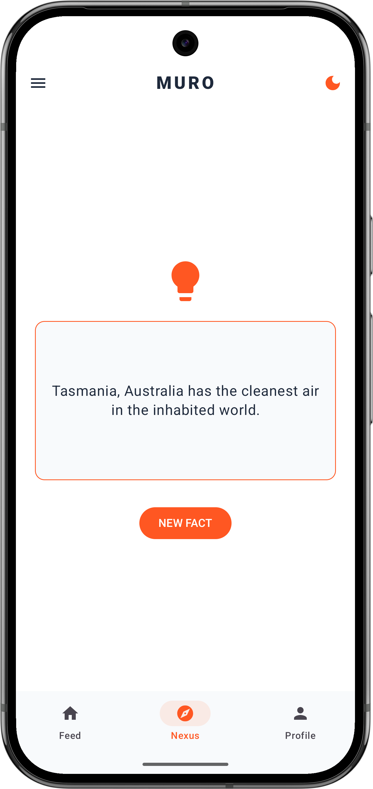
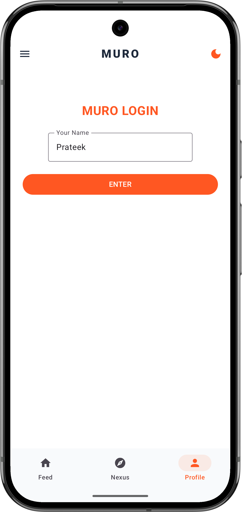

# MURO 🧠 - The Fact Check App
<sub>By Prateek Das</sub>

MURO is a modern, sleek Android application designed to deliver your daily dose of fascinating facts with a premium user experience. Built entirely using **Jetpack Compose**, it features a dynamic UI, real-time weather integration, and a social-like feed for fact enthusiasts.

## 🚀 Features

-   **Dynamic Themes:** Seamlessly switch between Light and Dark modes with smooth color transitions.
-   **Interactive Feed:** Browse through trending facts, interact with them, and enjoy a curated experience.
-   **Nexus Hub:** Generate random, mind-blowing facts on demand using the integrated Useless Facts API.
-   **Weather Integration:** Stay updated with real-time weather information for your campus/location.
-   **Personal Profile:** Customize your experience, verify your status, and publish your own discovered facts to the community.
-   **Modern UI/UX:** Built with Material 3, featuring glassmorphism elements, animated transitions, and a clean, intuitive navigation drawer.

## 🛠 Tech Stack

-   **Language:** [Kotlin](https://kotlinlang.org/)
-   **UI Framework:** [Jetpack Compose](https://developer.android.com/jetpack/compose)
-   **Architecture:** Modern Android Architecture (MVVM-ready)
-   **Networking:** Native URL connection for API fetching (Open-Meteo & Useless Facts API)
-   **Navigation:** [Compose Navigation](https://developer.android.com/jetpack/compose/navigation)
-   **Image Loading:** [Coil](https://coil-kt.github.io/coil/)
-   **Icons:** Material Extended Icons

## 📸 Screenshots

| Main Feed | Nexus (Facts) | Profile |
| :---: | :---: | :---: |
|  |  |  |

## 🏗 Installation

1.  Clone the repository:
    ```bash
    git clone https://github.com/Amazingdude1525/Muro.git
    ```
2.  Open the project in **Android Studio (Ladybug or newer)**.
3.  Sync the project with Gradle files.
4.  Run the app on an emulator or a physical device (API 24+).

## 🚧 Roadmap
MURO is currently in active development! 
- **Version 2.0 (Coming Soon):** Integration with a local database (Room) for saving favorite facts.
- **Version 2.1:** User authentication and global leaderboard.
- Stay tuned for more updates!

## 📩 Feedback & Connect
I would love to hear your thoughts or suggestions! 
Feel free to reach out for feedback or just to say hi:
- **Email:** [prateek.das2025@vitbhopal.ac.in](mailto:prateek.das2025@vitbhopal.ac.in)
- **LinkedIn:** [Prateek Das](https://www.linkedin.com/in/prateek-das-a45215252/)

**Feel free to share this project with fellow developers and fact-checkers!** 🌟

## 👨‍💻 Developer

**Prateek Das**
-   Registration ID: 25BCE10599
-   [GitHub](https://github.com/Amazingdude1525/)

---

*Crafted with ❤️ and Kotlin.*
